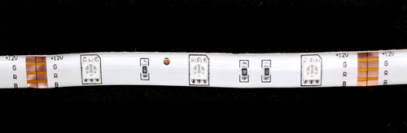

# RGBW Non-Addressable LED Strips (12V)

This guide is based on Adafruit's Tutorial [here](https://learn.adafruit.com/rgb-led-strips/overview)

-----
## What is an RGBW Non-Addressable LED Strip

A non-addressable LED strip is an *analog-type* strip that has all the LEDs connected in parallel; you can set the entire strip to any color you want, but you can't control the individual LED's colors.

 

---
### Powering ⚠️

Powering LED strips can be dangerous if done incorrectly.

Using the wrong voltage(V) or current(A) can damage components, cause overheating, and create a **fire hazard**.

**Correct powering is crucial.**

See the guide below to learn how to safely calculate and choose the correct power supply:

[Guide: How to power your RGBW non-addressable LED Strip](https://github.com/kingston-hackSpace/All-about_LEDs/blob/main/Guide_How-to-power-your-RGB-nonAddressable-LED-Strip.md)

-----
# TUTORIAL

-----
## HARDWARE

- Arduino UNO

- RGBW LED strip (21 LEDs / 7 segments)

- 12V 1A(or higher) Power Supply (correct current is crutial!)

- N-channel MOSFETs such as the IRLZ44N (x3)

-----
## WIRING
