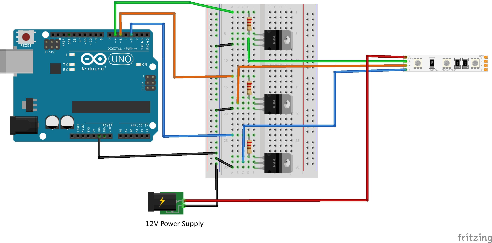

# RGBW Non-Addressable LED Strips (12V)

This guide is based on Adafruit's Tutorial [here](https://learn.adafruit.com/rgb-led-strips/overview)

-----
## What is an RGBW Non-Addressable LED Strip

A non-addressable LED strip is an *analog-type* strip that has all the LEDs connected in parallel; you can set the entire strip to any color you want, but you can't control the individual LED's colors.

 

---
### Powering ⚠️

Powering LED strips can be dangerous if done incorrectly.

Using the wrong voltage(V) or current(A) can damage components, cause overheating, and create a **fire hazard**.

**Correct powering is crucial.**

See the guide below to learn how to safely calculate and choose the correct power supply:

[Guide: How to power your RGBW non-addressable LED Strip](https://github.com/kingston-hackSpace/All-about_LEDs/blob/main/Guide_How-to-power-your-RGB-nonAddressable-LED-Strip.md)

-----
# TUTORIAL

-----
## HARDWARE

- Arduino UNO

- RGBW LED strip (21 LEDs / 7 segments)

- 12V 1A(or higher) Power Supply (correct current is crutial!)

- N-channel MOSFETs such as the IRLZ44N (x3)

-----
## WIRING


*Click on the image to expand diagram


Once you have the strip wired up, it is easy to control the color of the strip by using PWM output, for Arduino you can use analogWrite() on pins 3, 5, 6, 9, 10 or 11 (for classic Arduinos using the Atmega328 or 168). 

-----
## CODE and INSTRUCTIONS

- Upload the following code to your Arduino board

```
// color swirl! connect an RGB LED to the PWM pins as indicated
// in the #defines
// public domain, enjoy!
 
#define REDPIN 5
#define GREENPIN 6
#define BLUEPIN 3
 
#define FADESPEED 5     // make this higher to slow down
 
void setup() {
  pinMode(REDPIN, OUTPUT);
  pinMode(GREENPIN, OUTPUT);
  pinMode(BLUEPIN, OUTPUT);
}
 
 
void loop() {
  int r, g, b;
 
  // fade from blue to violet
  for (r = 0; r < 256; r++) { 
    analogWrite(REDPIN, r);
    delay(FADESPEED);
  } 
  // fade from violet to red
  for (b = 255; b > 0; b--) { 
    analogWrite(BLUEPIN, b);
    delay(FADESPEED);
  } 
  // fade from red to yellow
  for (g = 0; g < 256; g++) { 
    analogWrite(GREENPIN, g);
    delay(FADESPEED);
  } 
  // fade from yellow to green
  for (r = 255; r > 0; r--) { 
    analogWrite(REDPIN, r);
    delay(FADESPEED);
  } 
  // fade from green to teal
  for (b = 0; b < 256; b++) { 
    analogWrite(BLUEPIN, b);
    delay(FADESPEED);
  } 
  // fade from teal to blue
  for (g = 255; g > 0; g--) { 
    analogWrite(GREENPIN, g);
    delay(FADESPEED);
  } 
}
```

- Understanding the code:

    0 = no colour
    255 = full colour.


  
